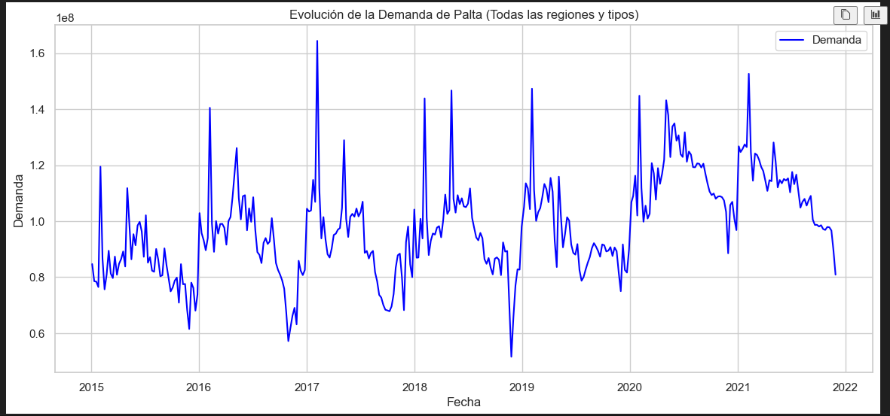
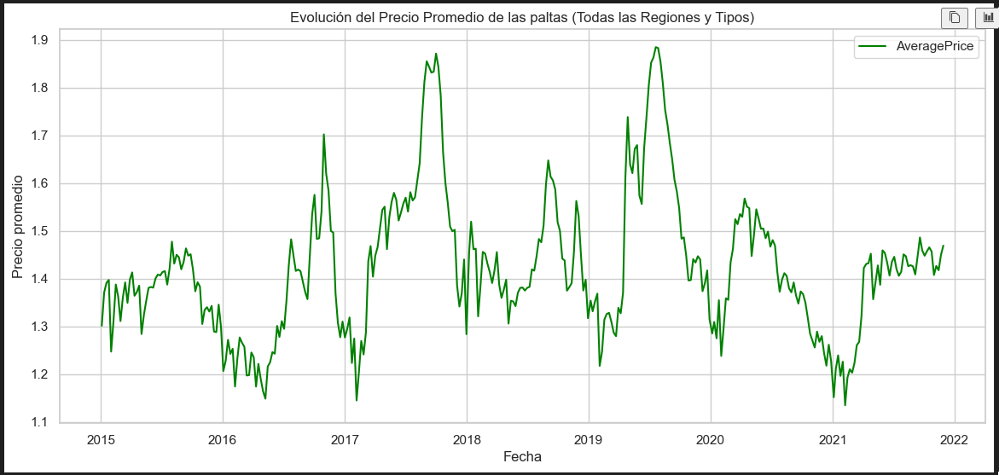
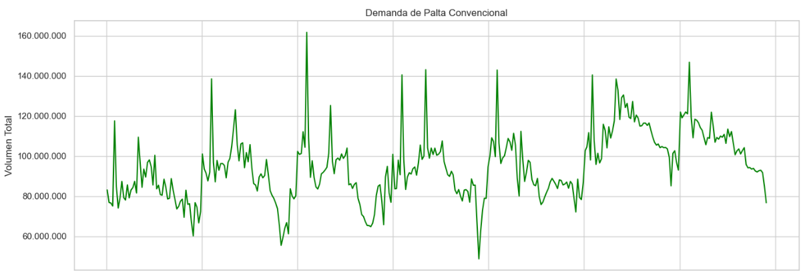
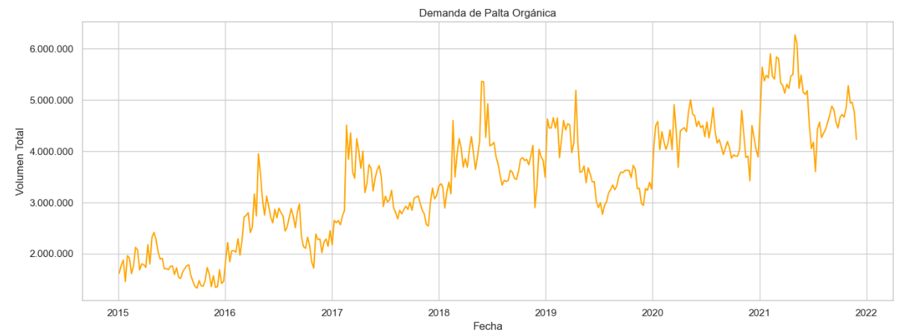
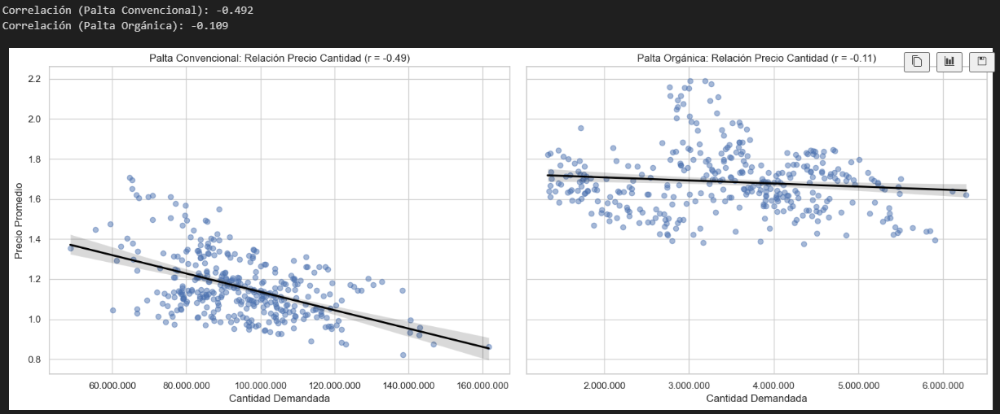
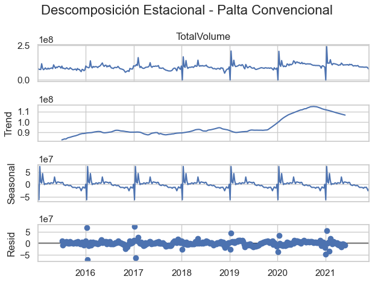
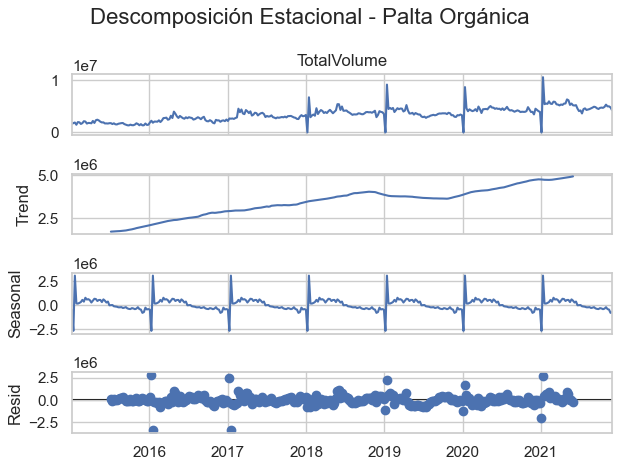
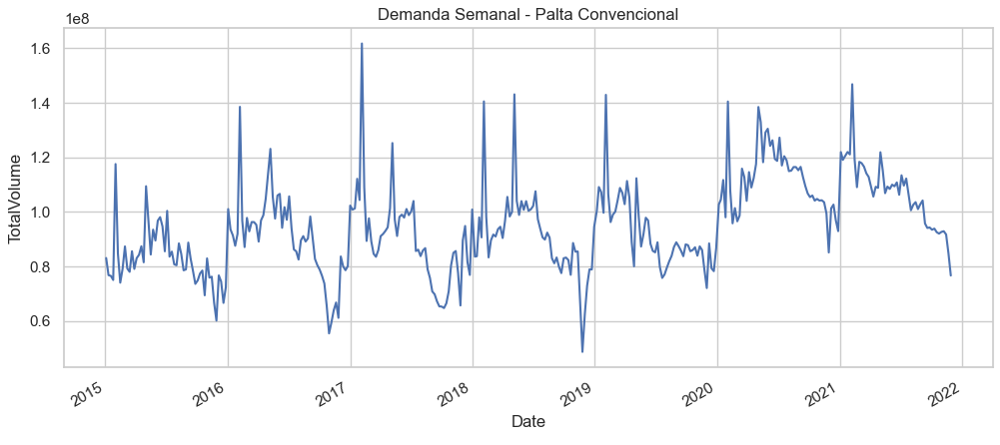

# Evolución de la demanda y precio (todas las regiones y tipos)

# Comparación de comportamiento entre tipos de paltas (convencional y orgánica) para cantidad y precio

# Gráfico de dispersión entre precio y cantidad de ambas paltas

# Descomposición estacional (palta convencional y orgánica)

# Preparación de datos para modelado de series temporales

# Separación set de entrenamiento y testeo (Validación Cruzada - Cross Validation)

