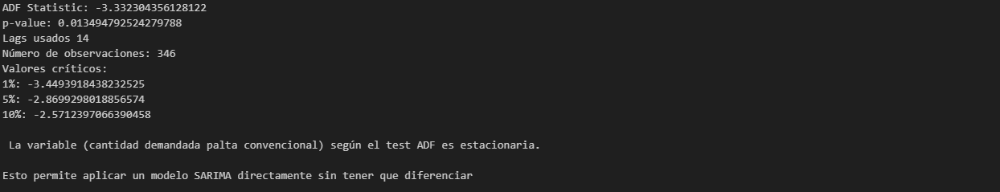
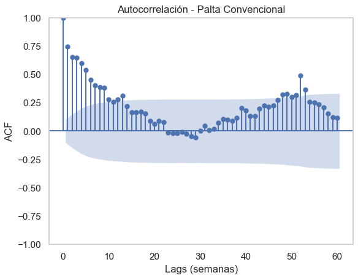
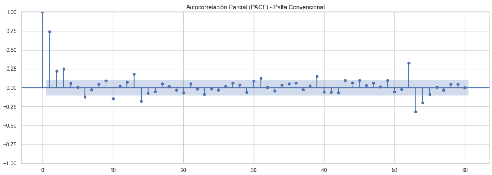
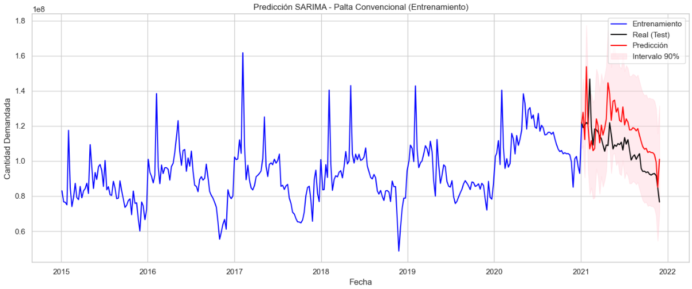
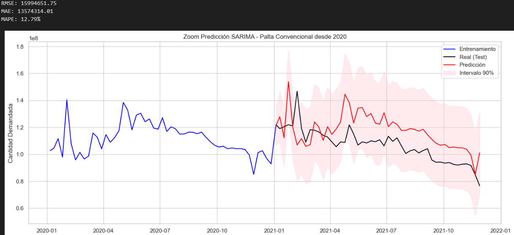
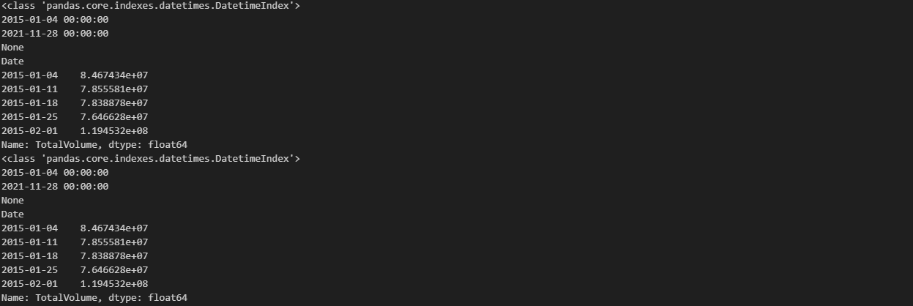
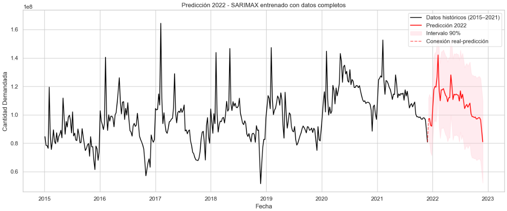
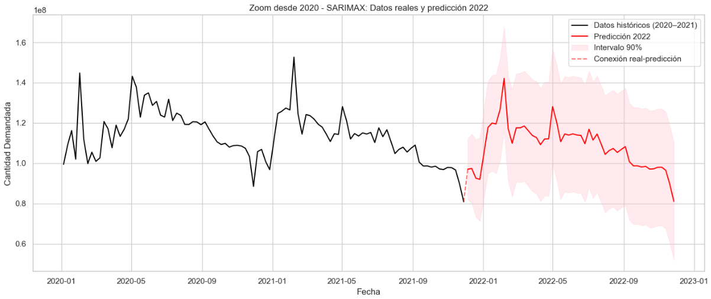
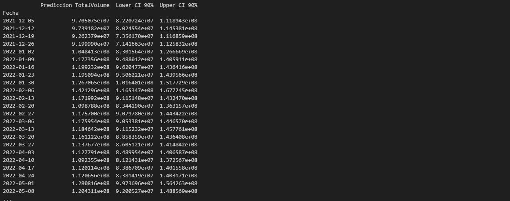

# Test Dick-Fuller para comprobar estacionariedad (Palta Convencional)

# Comprobación estacionalidad (periodicidad) mediante gráfico de autocorrelación (ACF - Palta Convencional)

# ACF y PACF para Palta Convencional

# Implementación SARIMA set entrenamiento y set de testeo - Palta Convencional

# Código para depurar futuros errores con SARIMAX para ambos tipos de palta (Convencional y Orgánica)

# Entrenamiento del modelo SARIMAX con el 100% de datos históricos (predicción 2022)

# Mostrar forecasting palta convencional 2022

