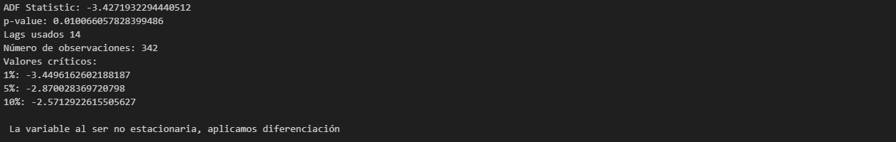
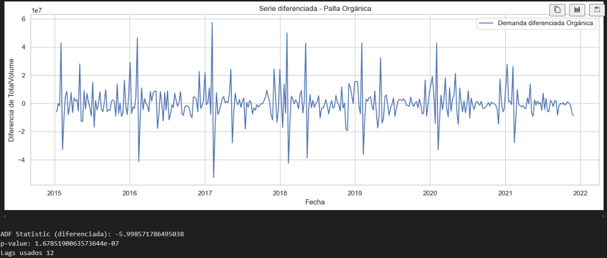
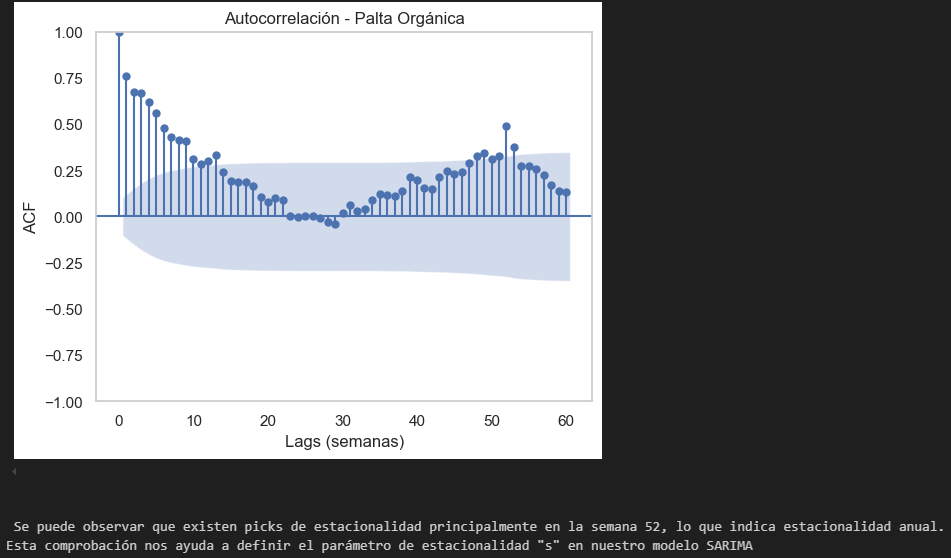
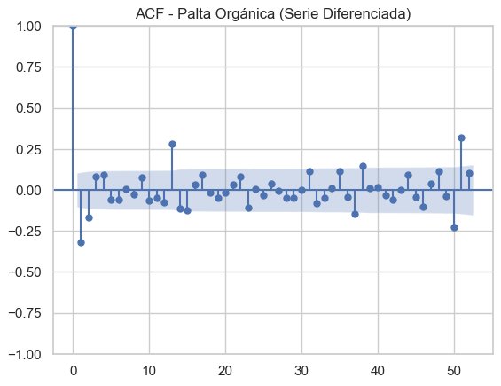
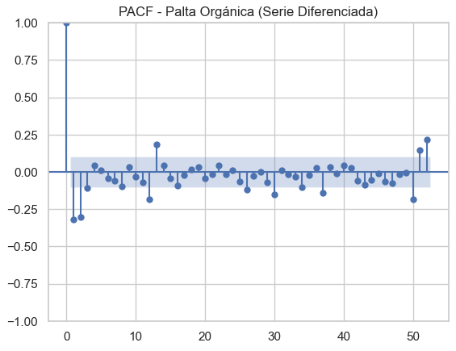
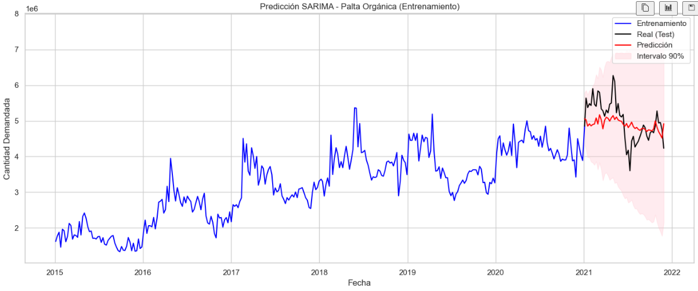
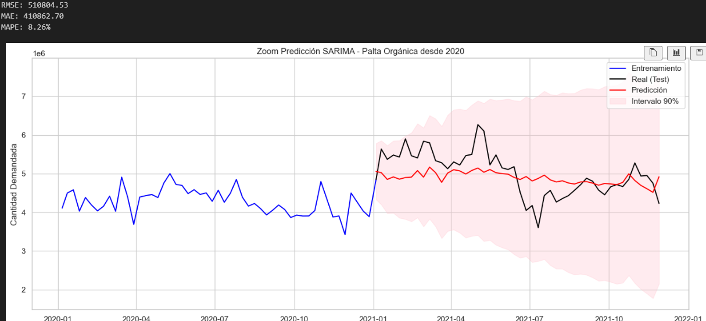
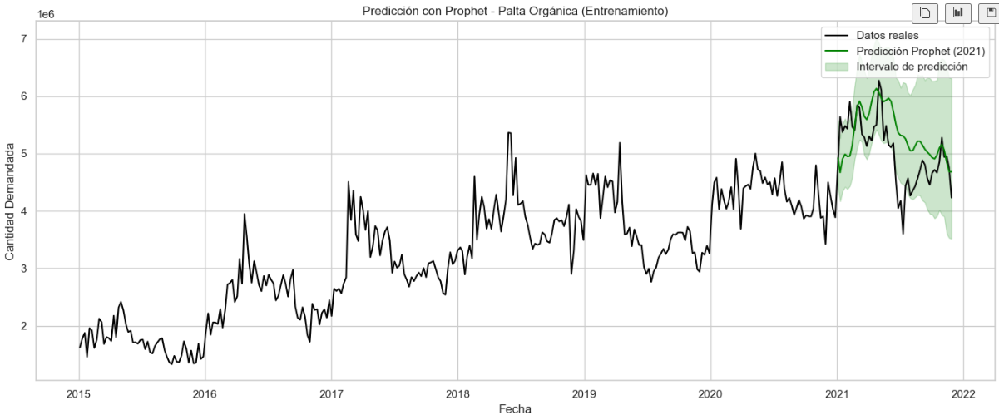
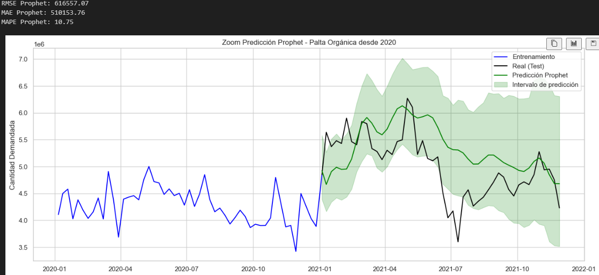
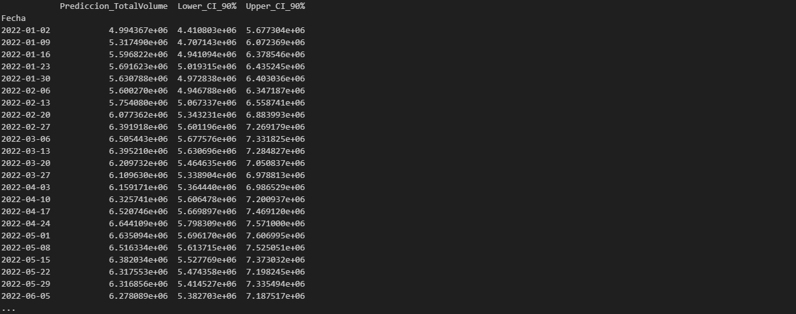

#Test Dick Fuller para comprobar estacionariedad (ADF - Augmented Dickey Fuller) para Palta Orgánica

# Serie diferenciada para palta orgánica

# Comprobación de estacionalidad (periodicidad) mediante gráfico de autocorrelación (ACF) para Palta Orgánica

# Comprobación de estacionalidad (periodicidad) mediante gráfico de autocorrelación (ACF) para Palta Orgánica 

# Implementación SARIMA set entrenamiento y set de testeo - Palta Orgánica

# Implementación Prophet para Palta Orgánica set de entrenamiento y testeo

# Implementación Prophet para predicción demanda Palta Orgánica 2022

# Mostrar forecasting palta orgánica 2022

